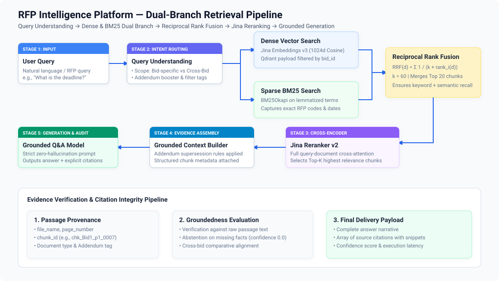
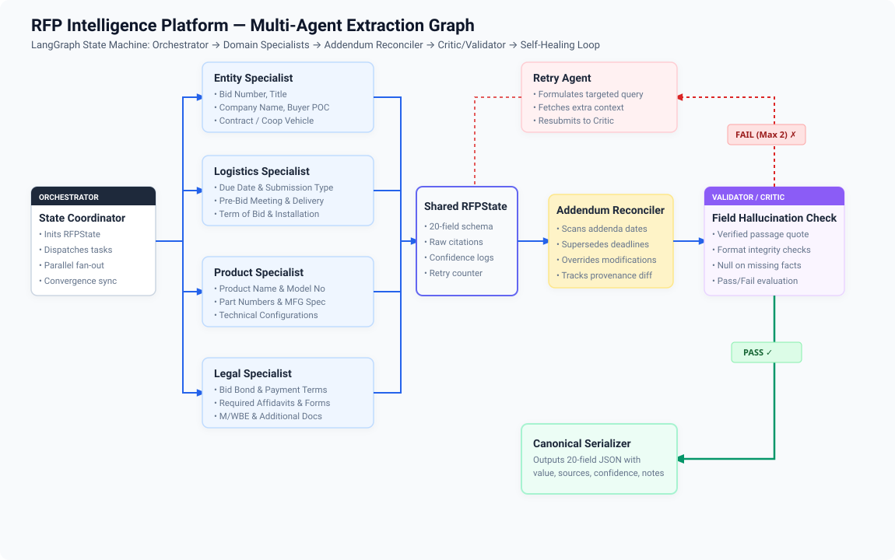
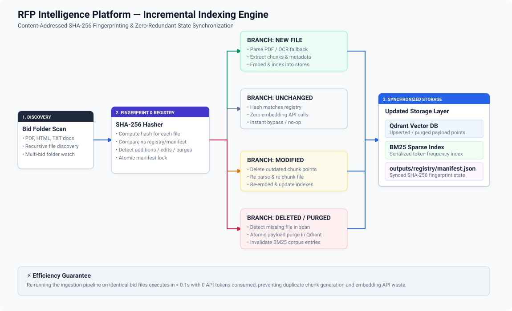

# RFP Intelligence Platform: RAG Search Engine & Multi-Agent System

An evidence-first, citation-grounded enterprise AI system engineered to process complex procurement bid packages containing portal HTML notices, formal Request for Proposal (RFP) PDFs, sequential addenda amendments, technical hardware specification sheets, and legal compliance affidavits.

---

## 🌐 Live Application & Demo Video
- **Live Platform**: [**https://rfp-intelligence-platform.onrender.com/**](https://rfp-intelligence-platform.onrender.com/)
- **Demo Video (YouTube)**: [**https://youtu.be/XdXU4CibKhU**](https://youtu.be/XdXU4CibKhU)
- **Demo Video (Google Drive)**: [**Google Drive Demonstration Video**](https://drive.google.com/file/d/1EhDkgWStciDn09bj8D-I0wVlPMWSmtYm/view?usp=sharing)

> The platform and video demonstration walk through the end-to-end system: system architecture, dual-branch hybrid retrieval with listwise reranking, grounded Q&A with verifiable chunk-level citations, multi-agent 20-field extraction, chronological addendum reconciliation (handling superseded deadlines), negative/unanswerable query abstention, agent execution traces & observability, unseen-bid dynamic ingestion, and incremental SHA-256 indexing.

---

## 📋 Deliverables at a Glance

| Deliverable | Repository Path / Artifact | Description |
|---|---|---|
| **Source Code** | [`app/`](app/), [`frontend/`](frontend/), [`tests/`](tests/) | Complete backend pipeline, 8-screen Streamlit dashboard, and test suite |
| **System Architecture Diagram** | [`docs/architecture.svg`](docs/architecture.svg) | Full end-to-end system architecture and dataflow diagram |
| **Retrieval Pipeline Diagram** | [`docs/retrieval_pipeline.svg`](docs/retrieval_pipeline.svg) | Dual-branch Dense + BM25, RRF fusion, and Jina listwise reranker |
| **Multi-Agent Workflow Diagram** | [`docs/multi_agent_workflow.svg`](docs/multi_agent_workflow.svg) | LangGraph StateGraph, parallel specialists, critic, and retry repair loop |
| **Incremental Indexing Diagram** | [`docs/incremental_indexing.svg`](docs/incremental_indexing.svg) | Content-addressed SHA-256 discovery, branch execution, and store synchronization |
| **Canonical JSON Extractions** | [`outputs/Bid1_extracted.json`](outputs/Bid1_extracted.json)<br>[`outputs/Bid2_extracted.json`](outputs/Bid2_extracted.json)<br>[`outputs/Bid4_extracted.json`](outputs/Bid4_extracted.json)<br>[`outputs/Bid5_extracted.json`](outputs/Bid5_extracted.json) | Validated 20-field structured JSON records with chunk provenance |
| **Retrieval Evaluation Report** | [`docs/retrieval_evaluation.md`](docs/retrieval_evaluation.md) | Dedicated benchmark report across 4 retrieval configurations |
| **Gold Question Set** | [`eval/gold_questions.json`](eval/gold_questions.json) | 28 gold-standard procurement queries with target passages |
| **Evaluation Benchmark Results** | [`eval/results/latest.csv`](eval/results/latest.csv)<br>[`eval/results/latest.json`](eval/results/latest.json) | Quantitative evaluation metrics (`Recall@k`, `MRR`, `nDCG@k`) |
| **Sample Q&A Verification Log** | [`docs/sample_qa_log.md`](docs/sample_qa_log.md)<br>[`outputs/qa_log.json`](outputs/qa_log.json) | 10 end-to-end verified procurement Q&A scenarios with citations |
| **Agent Observability Trace** | [`outputs/traces/sample_extraction_trace.json`](outputs/traces/sample_extraction_trace.json)<br>[`outputs/traces/sample_extraction_trace.md`](outputs/traces/sample_extraction_trace.md) | Detailed trace of agent dispatch, state convergence, and validation |
| **Unseen-Bid Verification Report** | [`outputs/unseen_bid_report.json`](outputs/unseen_bid_report.json) | Generalization proof without bid-specific code modifications |

---

## 📂 Repository Structure

```text
├── app/
│   ├── agents/            # LangGraph multi-agent specialists, orchestrator & retry node
│   ├── api/               # FastAPI route controllers (/search, /extract, /ask, /index)
│   ├── chunking/          # Section-aware text & markdown table chunkers
│   ├── embeddings/        # Jina Embeddings v3 client with SQLite persistence cache
│   ├── evidence/          # Canonical evidence store & immutable citation model
│   ├── extraction/        # Field mapper, LLM extractor, and schema definitions
│   ├── indexing/          # Incremental discovery & SHA-256 registry engine
│   ├── ingestion/         # PyMuPDF, pdfplumber & Groq Vision OCR fallback parsers
│   ├── lexical/           # BM25Okapi search with custom alphanumeric tokenizer
│   ├── observability/     # Distributed agent execution tracer and audit logger
│   ├── qa/                # Evidence-grounded Q&A engine & intent understanding
│   ├── reconciliation/    # Chronological addendum revision & override analyzer
│   ├── rerankers/         # Jina Reranker v3.5 cross-encoder integration
│   ├── validation/        # Deterministic provenance validator & citation auditor
│   └── vectorstore/       # Qdrant client with payload filtering & collection management
├── data/
│   ├── raw/               # Raw bid packages (Bid1, Bid2, Bid4, Bid5)
│   └── bm25/              # Persisted BM25 token corpus
├── docs/
│   ├── architecture.svg          # Primary system architecture SVG
│   ├── retrieval_pipeline.svg    # Supporting retrieval pipeline SVG
│   ├── multi_agent_workflow.svg  # Supporting multi-agent workflow SVG
│   ├── incremental_indexing.svg  # Supporting incremental indexing SVG
│   ├── retrieval_evaluation.md   # Comprehensive retrieval benchmark report
│   └── sample_qa_log.md          # 10-question verified Q&A audit log
├── eval/
│   ├── gold_questions.json       # 28 gold retrieval benchmark questions
│   ├── run_retrieval_eval.py     # Canonical evaluation benchmark runner
│   └── results/                  # Serialized evaluation metrics (latest.csv/json)
├── frontend/
│   └── streamlit_app.py          # 8-screen enterprise Streamlit dashboard
├── outputs/
│   ├── Bid1_extracted.json       # Dallas ISD extraction output
│   ├── Bid2_extracted.json       # MD State Treasurer extraction output
│   ├── Bid4_extracted.json       # Unseen Bid4 extraction output
│   ├── Bid5_extracted.json       # Unseen Bid5 extraction output
│   ├── qa_log.json               # Raw Q&A execution records
│   ├── unseen_bid_report.json    # Zero-code-change generalization report
│   └── traces/                   # Serialized multi-agent execution traces
├── tests/                        # 93 automated unit, integration, and API tests
├── docker-compose.yml            # Containerized multi-service configuration
├── requirements.txt              # Production dependency specifications
└── README.md                     # System documentation
```

---

## 🏗️ System Architecture

The platform combines a **dual-branch hybrid retrieval and reranking engine** with a **LangGraph state-machine multi-agent extraction workflow**:


### 1. Dual-Branch Retrieval Pipeline
Processes complex queries by executing dense semantic search and exact-token lexical search in parallel, fusing candidates via Reciprocal Rank Fusion (RRF), and applying cross-encoder listwise reranking:



### 2. Multi-Agent Extraction & Self-Healing Workflow
Executes parallel domain specialist agents over a shared `RFPState`, applies chronological addendum reconciliation, audits citations with a deterministic critic, and triggers targeted repair loops:



### 3. Incremental Indexing Engine
Fingerprints document content using SHA-256 hashes to eliminate redundant parsing and embedding API calls, synchronizing additions, modifications, and deletions into Qdrant and BM25:



---

## 🎯 Core Problem & Engineering Invariants

Procurement solicitations present distinct challenges that break standard naive RAG pipelines:
1. **Addendum Supersession**: Addendums issued weeks after the base RFP legally modify deadlines, scopes, and requirements (e.g., Dallas ISD Bid1 proposal due date was extended from June 27, 2024 to July 9, 2024 by Addendum 2).
2. **Exact Identifier Retention**: Critical codes (e.g., PORFP `#E20P4600040`, part `#WD22TB4`, bond percentages) are frequently lost in vector-only embeddings.
3. **Hallucination Risk**: Large language models tend to fabricate missing values when context is ambiguous.

### Core Architectural Invariant
> **"LLMs interpret retrieved evidence; deterministic software controls schemas, provenance, citation validation, and addendum precedence."**
- Every extracted fact or Q&A statement must be backed by a verifiable `chunk_id`, `file_name`, and `page_number`.
- Unsubstantiated fields are strictly defaulted to `null` with calibrated `confidence: 0.0`.

---

## 🧠 Prompt Design

The system implements specialized prompt contracts tailored for domain accuracy, strict evidence grounding, and structured JSON outputs:

| Prompt Stage | Target Module | Design Purpose & Grounding Constraints |
|---|---|---|
| **Specialist Extraction Prompts** | [`app/extraction/llm.py`](app/extraction/llm.py)<br>[`app/agents/`](app/agents/) | Enforces field-specific extraction across domain specialists (`Entity`, `Logistics`, `Product`, `Legal`). Prompts mandate that the model **never use outside world knowledge**, output `null` for unmentioned fields, and return exact chunk IDs for every non-null value. |
| **Q&A Grounding Prompt** | [`app/qa/engine.py`](app/qa/engine.py) | Instructs the model to answer natural-language procurement queries strictly from provided evidence passages. If evidence is missing, it is constrained to output exactly `"Not found in documents."` with `confidence: 0.0`. |
| **Addendum Reconciliation** | [`app/reconciliation/`](app/reconciliation/) | Evaluates addenda chronologically to identify modifications, extensions, and clarifications, generating structured `AddendumChange` records that override base fields. |
| **Validator / Critic Audit** | [`app/validation/validator.py`](app/validation/validator.py) | Programmatic and prompt-based auditor that rejects ungrounded claims (`NO EVIDENCE -> NO VALUE`), ensures citations exist in the `EvidenceStore`, and verifies non-empty source passages. |
| **Retry & Re-retrieval Prompt** | [`app/agents/retry_agent.py`](app/agents/retry_agent.py) | Formulates expanded targeted queries for rejected fields, performs secondary focused retrieval (top-k = 6), and resubmits evidence to the extractor up to 2 retry attempts. |

---

## 📊 Extraction Results

The extraction pipeline produces one canonical JSON output per processed bid folder. Every extracted field conforms to the standardized four-part schema:
- `value`: Extracted entity string/number, or `null` if ungrounded.
- `sources`: Array of chunk-level citations containing `file_name`, `page_number`, `chunk_id`, and exact source text.
- `confidence`: Calibrated confidence score (`0.0` to `1.0`).
- `notes`: Validation rationale, addendum override history, or `"Not found in documents."`.

### JSON Field Example:
```json
{
  "Due Date": {
    "value": "July 9, 2024 at 2:00 PM CST",
    "sources": [
      {
        "file_name": "Addendum 2 RFP JA-207652 Student and Staff Computing Devices.pdf",
        "page_number": 1,
        "chunk_id": "chk_Bid1_p1_0001_529cd0248ff3",
        "text": "The Purpose of this Addendum is to extend the due date of this RFP.\nThe new due date for this RFP will be July 9, 2024 at 2:00 PM CST.",
        "bid_id": "Bid1",
        "section": "END OF ADDENDUM",
        "document_type": "addendum",
        "addendum_number": 2
      }
    ],
    "confidence": 1.0,
    "notes": "Addendum 2 explicitly states the new due date for the RFP is July 9, 2024 at 2:00 PM CST, superseding the original date of June 27, 2024 found in the main RFP.",
    "reason": null
  }
}
```

### Processed Bid Outputs:
- [`outputs/Bid1_extracted.json`](outputs/Bid1_extracted.json) — Dallas ISD Student & Staff Devices (Reconciled to `July 9, 2024 at 2:00 PM CST` per Addendum 2)
- [`outputs/Bid2_extracted.json`](outputs/Bid2_extracted.json) — MD State Treasurer (PORFP `#E20P4600040`, `Dell Latitude 5550`, `WD22TB4`, Contract & Mercury Affidavits)
- [`outputs/Bid4_extracted.json`](outputs/Bid4_extracted.json) — Municipal Network Equipment Refresh (Zero-shot extraction on unseen bid)
- [`outputs/Bid5_extracted.json`](outputs/Bid5_extracted.json) — Fleet EV Charging Infrastructure (Zero-shot extraction on unseen bid)

---

## 🧪 Unseen-Bid Generalization

The platform was evaluated against previously unseen bid packages to verify that no bid-specific logic or rules were hardcoded.
- Generalization Artifacts: [`outputs/Bid4_extracted.json`](outputs/Bid4_extracted.json), [`outputs/Bid5_extracted.json`](outputs/Bid5_extracted.json)
- Validation Report: [`outputs/unseen_bid_report.json`](outputs/unseen_bid_report.json)

As documented in `unseen_bid_report.json`, **`application_code_changed: false`** across all unseen bid processing runs. The system dynamically discovered files, parsed tables, resolved addenda, and populated all 20 canonical fields using generic multi-agent coordination.

---

## 💬 Sample Q&A Verification Log

The system includes a dedicated Q&A verification log covering 10 distinct procurement scenarios across single-bid lookups, exact identifier resolutions, legal compliance mandates, addendum supersessions, cross-bid comparative matrices, and negative/unanswerable queries:
- Markdown Report: [**`docs/sample_qa_log.md`**](docs/sample_qa_log.md)
- Raw JSON Log: [`outputs/qa_log.json`](outputs/qa_log.json)

### Summary of Tested Q&A Scenarios:
1. **Bid1 Deadline (Addendum-Aware)**: Reconciles deadline to July 9, 2024 at 2:00 PM CST citing Addendum 2.
2. **Bid2 Required Affidavits (Legal)**: Identifies Contract Affidavit and Mercury Affidavit with page citations.
3. **Bid1 Addendum 2 Changes (Modification)**: Explains due date extension and contract incorporation.
4. **Cross-Bid Warranty Comparison (Synthesis)**: Compares Dallas ISD manufacturer warranty vs MD State Treasurer 3-Year Dell Limited Extended Warranty.
5. **Bid1 Bond Requirement (Compliance)**: Confirms no bid bond is required for standard device procurement.
6. **Bid2 Laptop Model (Product)**: Retrieves Dell Latitude 5550 with Intel Core Ultra 5 125U processor.
7. **Bid2 Processor Specs (Hardware)**: Extracts exact CPU specifications and RAM/SSD configuration.
8. **Bid2 PORFP Number (Identifier)**: Resolves exact PORFP identifier `#E20P4600040` via BM25 + Dense fusion.
9. **Bid2 Delivery Schedule (Logistics)**: Extracts 45-day delivery requirement to MD State Treasurer's Office.
10. **Negative / Unanswerable Query (Abstention)**: Correctly abstains and returns `"Not found in documents."` with `confidence: 0.0` for missing employee headcount requirement.

---

## 📈 Quantitative Retrieval Evaluation

Full evaluation methodology, dataset distribution, and failure analysis are documented in [**`docs/retrieval_evaluation.md`**](docs/retrieval_evaluation.md).

The evaluation is benchmarked over 28 gold-standard multi-document procurement questions ([`eval/gold_questions.json`](eval/gold_questions.json)).

> **Evaluation Invariant**: Retrieval metrics (`Recall@k`, `MRR`, `nDCG@k`) are computed on answerable retrieval questions. Negative/unanswerable queries are evaluated separately for proper abstention and citation absence.

### Benchmark Results:

| Retrieval Configuration | Recall @ 1 | Recall @ 3 | Recall @ 5 | MRR | nDCG @ 5 | Latency (p50) | Latency (p95) |
|---|:---:|:---:|:---:|:---:|:---:|:---:|:---:|
| **Dense Only (Jina v3)** | 0.520 | 0.720 | 0.840 | 0.635 | 0.525 | 847 ms | 1,085 ms |
| **BM25 Only** | 0.560 | 0.880 | 0.960 | 0.713 | 0.582 | 0.48 ms | 0.80 ms |
| **Hybrid (Dense + BM25 + RRF)** | 0.680 | 0.880 | 0.880 | 0.767 | 0.631 | 4.81 ms | 8.34 ms |
| **Hybrid + Jina Reranker v3.5** | **0.840** | **0.880** | **0.880** | **0.860** | **0.662** | 685 ms | 779 ms |

### Running the Evaluation Benchmark:
```bash
python -m eval.run_retrieval_eval
```
*Outputs are saved to [`eval/results/latest.csv`](eval/results/latest.csv) and [`eval/results/latest.json`](eval/results/latest.json).*

---

## 🌐 API & User Interfaces

### FastAPI Backend Endpoints (`http://127.0.0.1:8000`)
- `GET /health` — Service health and active configuration status.
- `POST /index` — Incrementally ingest and index bid packages by folder path.
- `POST /search` — Dual-branch dense + BM25 + RRF + listwise reranking search.
- `POST /extract` — Multi-agent 20-field structured extraction with validation.
- `POST /ask` — Evidence-grounded natural language Q&A with citation audit.

### Streamlit Interactive UI (`http://127.0.0.1:8501`)
The platform includes an 8-screen dashboard:
1. **Overview Dashboard**: System status, collection statistics, index sizes.
2. **Hybrid Search**: Query input, metadata filters, ranked evidence cards with score breakdowns.
3. **Evidence Q&A**: Interactive question-answering with expandable citation cards.
4. **20-Field Extraction**: Structured view of extracted procurement fields with source badges.
5. **Addendum History**: Chronological timeline of revisions and superseded fields.
6. **Compare Bids**: Side-by-side comparative matrices across multiple solicitations.
7. **Document Indexing**: One-click folder ingestion with incremental sync telemetry.
8. **Agent Observability Trace**: Step-by-step visual trace of agent executions and retry cycles.

---

## ⚡ Quick Start & Installation

### Option A: Local Python Setup
```bash
# 1. Clone repository
git clone https://github.com/Anurag49x/RFP-intelligence-platform.git
cd Assignment

# 2. Setup virtual environment
python -m venv venv
venv\Scripts\activate      # On Linux/macOS: source venv/bin/activate

# 3. Install dependencies
pip install -r requirements.txt

# 4. Configure environment variables
cp .env.example .env       # Provide GROQ_API_KEY and JINA_API_KEY in .env

# 5. Launch FastAPI Backend
uvicorn app.api.main:app --host 127.0.0.1 --port 8000 --reload

# 6. Launch Streamlit UI (in a second terminal)
streamlit run frontend/streamlit_app.py --server.port 8501
```

### Option B: Docker Compose (One-Command Startup)
```bash
docker compose up --build
```
*Automatically starts Qdrant (`6333`), FastAPI (`8000`), and Streamlit (`8501`).*

---

## 🧪 Automated Test Suite

The repository includes **93 passing automated tests** verifying parsers, chunking, embeddings, BM25, Qdrant, RRF, reranking, multi-agent workflows, addendum reconciliation, citation auditing, and API endpoints:
```bash
pytest -v
```

---

## ⚠️ Assumptions & Limitations

### Assumptions:
1. Bid packages consist of `.pdf`, `.html`, or text documents.
2. Addenda contain sequential numbering or chronological dates for ordering.
3. Fields absent from the documents must be returned as `null` rather than estimated.

### Limitations:
- **External API Latency & Rate Limits**: Heavy concurrent extraction relies on external LLM and embedding APIs (Groq and Jina AI), which may encounter provider rate limits during bulk multi-thousand-page processing.
- **OCR Quality Dependence**: Scanned document fidelity depends on underlying scan resolution; severely degraded or skewed scans may require pre-processing enhancements.
- **Large Document Batching**: Solicitations exceeding 1,000 pages require batched embedding passes to prevent memory pressure.
- **Benchmark Coverage Limitations**: The 28-question gold benchmark focuses on core procurement scenarios; specialized domain extensions (e.g., construction bonding nuances) require additional domain questions.
- **Citation vs Semantic Evidence Validation**: The deterministic validator verifies chunk existence, page accuracy, and non-empty text excerpts; deep semantic nuance validation is reinforced by the LLM Critic.

---

## 🎬 Submission Verification Summary

- **Demo Video (YouTube)**: [**https://youtu.be/XdXU4CibKhU**](https://youtu.be/XdXU4CibKhU)
- **Demo Video (Google Drive)**: [**Google Drive Demonstration Link**](https://drive.google.com/file/d/1EhDkgWStciDn09bj8D-I0wVlPMWSmtYm/view?usp=sharing)
- **Evaluation Report**: [`docs/retrieval_evaluation.md`](docs/retrieval_evaluation.md)
- **Sample Q&A Log**: [`docs/sample_qa_log.md`](docs/sample_qa_log.md)
- **Unseen-Bid Verification**: [`outputs/unseen_bid_report.json`](outputs/unseen_bid_report.json)
