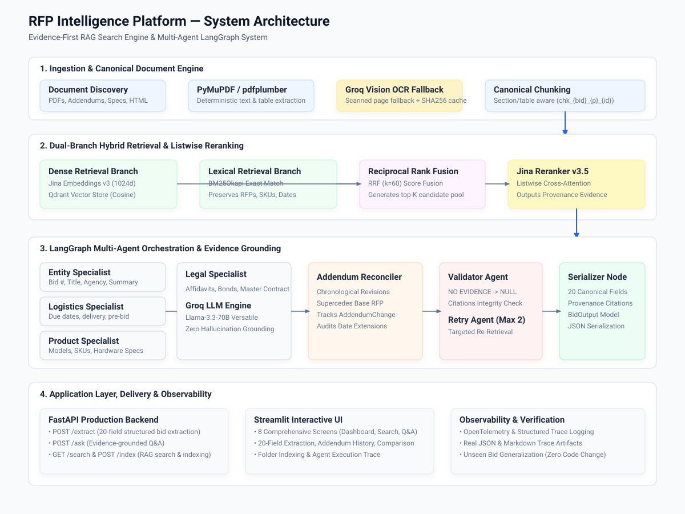

# RFP Intelligence Platform: RAG Search Engine & Multi-Agent System

An evidence-first, citation-grounded AI system engineered to process complex procurement and RFP (Request for Proposal) bid packages containing portal HTML pages, main RFP PDFs, addendums, technical hardware specifications, and legal affidavits.

---

## 1. Problem
Procurement bid information is fragmented across disparate document types:
- Portal HTML overview pages
- Formal Request for Proposal (RFP) PDFs
- Sequential Addendums & Amendments (which legally supersede base specifications)
- Technical specification sheets & hardware matrices
- Mandatory legal and compliance affidavits (e.g. Non-Collusion, Mercury Content, Debarment)

Standard naïve RAG (`PDF -> embedding -> top-k -> LLM`) fails because:
1. Addendums legally override original deadlines and terms (e.g., Dallas ISD Bid1 proposal due date was extended by Addendum 2).
2. Exact identifiers (PORFP numbers, model SKUs, bond percentages) are lost in vector-only search.
3. LLMs hallucinate requirements when given ambiguous or incomplete context.

This platform enforces the invariant: **LLMs interpret retrieved evidence; deterministic software controls schemas, provenance, citation validation, and addendum precedence.**

---

## 2. Architecture
The system employs a dual-branch hybrid retrieval pipeline coupled with a LangGraph multi-agent orchestration architecture:



- **LLM / Vision OCR**: Groq (`llama-3.3-70b-versatile` & `llama-3.2-11b-vision-preview`)
- **Embeddings & Reranking**: Jina AI (`jina-embeddings-v3` & `jina-reranker-v3.5`)
- **Vector Database**: Qdrant (1024-dimensional Cosine similarity with payload filtering)
- **Lexical Search**: BM25Okapi (identifier-preserving tokenizer)
- **Fusion**: Reciprocal Rank Fusion (RRF with \(k=60\))
- **Multi-Agent Orchestration**: LangGraph StateGraph (parallel specialist fan-out, reconciliation, deterministic validator, and targeted repair loop)
- **Backend**: FastAPI
- **Frontend**: Streamlit 8-screen Interactive Dashboard

---

## 3. System Flow
1. **Document Discovery & Ingestion**: Classifies documents into `rfp`, `addendum`, `specs`, `affidavit`, `bid_page`.
2. **Text & Table Extraction**: PyMuPDF and pdfplumber parse clean text and markdown tables; scanned/image pages trigger Groq Vision OCR with SHA-256 result caching.
3. **Canonical Chunking**: Section-aware and atomic table chunking with deterministic IDs (`chk_{bid}_{p}_{id}`).
4. **Dual-Branch Indexing**: Dense embeddings stored in Qdrant; tokenized chunks indexed in local BM25.
5. **Hybrid Retrieval & Reranking**: Parallel Dense and BM25 searches combined via RRF (\(k=60\)), then refined by Jina Listwise Reranker.
6. **Multi-Agent Extraction**: Parallel specialist agents (Entity, Logistics, Product, Legal) extract candidate field values.
7. **Addendum Reconciliation**: Evaluates addenda chronologically and applies overrides to superseded fields.
8. **Deterministic Validator & Retry Loop**: Audits provenance (`NO EVIDENCE -> NO VALUE`); failed fields trigger targeted query expansion and re-retrieval up to 2 times.
9. **Grounded Delivery**: Serves 20 canonical fields and natural-language Q&A backed by verifiable citations.

---

## 4. Document Ingestion
- Discovers `.pdf` and `.html` files deterministically.
- Classifies each file based on title, content keywords, and folder layout.
- Extracts tabular data as clean Markdown tables, preserving multi-column relationships.
- Collapses repeated headers/footers and normalizes unicode whitespace.

---

## 5. OCR Fallback
- Detection: Pages with usable text density (< 50 non-whitespace characters or raw image dominance) trigger OCR fallback.
- Engine: Groq Vision (`llama-3.2-11b-vision-preview`).
- Caching: SHA-256 page image hashes cached in SQLite to prevent duplicate API spend.

---

## 6. Canonical Evidence Model
Every retrieved passage and citation implements the immutable `Evidence` / `Citation` schema:
```python
class Citation(BaseModel):
    chunk_id: str
    file_name: str
    page_number: int
    text: Optional[str] = None
    bid_id: Optional[str] = None
    section: Optional[str] = None
    document_type: Optional[str] = None
    addendum_number: Optional[int] = None
```

---

## 7. Chunking Strategy
- **Text Chunker**: Heading and section boundary detection with 500-token maximum size and 50-token semantic overlap.
- **Table Chunker**: Small tables remain atomic markdown chunks. Massive tables are split row-wise with persistent markdown table headers on every chunk.
- **Deterministic IDs**: `chk_{bid_id}_p{page}_{order:04d}_{sha256[:12]}` ensuring idempotent indexing.

---

## 8. Embedding Model
- **Model**: `jina-embeddings-v3` (1024 dimensions, normalized).
- **Task Optimization**: `retrieval.passage` for document chunks; `retrieval.query` for search queries.
- **Persistence**: SQLite embedding cache (`outputs/cache/embeddings.db`) avoiding redundant API queries.

---

## 9. Vector Store
- **Store**: Qdrant (`outputs/qdrant_storage` or remote `QDRANT_URL`).
- **Index**: HNSW with Cosine distance metric.
- **Payload Indexing**: Native filtering on `bid_id`, `document_type`, `addendum_number`, `file_name`.
- **Thread Safety**: Thread-safe client caching ensuring multi-agent parallel branch stability.

---

## 10. BM25 Lexical Search
- **Implementation**: `rank_bm25` (BM25Okapi).
- **Custom Tokenizer**: Regex `[a-zA-Z0-9]+(?:[-_./][a-zA-Z0-9]+)*` preserving exact alphanumeric identifiers like `#E20P4600040`, `WD22TB4`, `060B5400007`.

---

## 11. Hybrid Retrieval
Unifies dense semantic vector similarity with BM25 keyword matching to eliminate false negatives and vocabulary mismatch.

---

## 12. Reciprocal Rank Fusion (RRF)
Combines ranked lists from dense and lexical retrieval branches:
\[
RRF(d) = \sum_{m \in M} \frac{1}{60 + r_m(d)}
\]
Generates a rich candidate pool (\(k=20-80\)) for listwise reranking.

---

## 13. Reranking
- **Model**: `jina-reranker-v3.5`.
- **Mechanism**: Listwise cross-attention computing query-passage relevance scores, filtering out irrelevant candidates before LLM consumption.

---

## 14. Metadata Filtering
Supports exact filtering by `bid_id`, `document_type` (`rfp`, `addendum`, `specs`, `affidavit`), `addendum_number`, and `file_name`.

---

## 15. Query Understanding
The `QueryUnderstandingEngine` inspects user questions to:
1. Preserve exact alphanumeric identifiers.
2. Classify intent: `SINGLE_BID`, `ADDENDUM_AWARE`, `WHAT_CHANGED`, `CROSS_BID_COMPARISON`, `LEGAL_REQUIREMENT`, `GENERAL`.
3. Expand targeted keyword queries.

---

## 16. Multi-Agent Architecture
LangGraph StateGraph fans out to 4 specialized agents in parallel:
- **Entity Specialist**: Extracts `bid_number`, `title`, `company_name`, `bid_summary`.
- **Logistics Specialist**: Extracts `due_date`, `bid_submission_type`, `term_of_bid`, `pre_bid_meeting`, `installation`, `delivery_date`, `payment_terms`, `contact_info`.
- **Product Specialist**: Extracts `mfg_for_registration`, `model_no`, `part_no`, `product`, `product_specification`.
- **Legal Specialist**: Extracts `bid_bond_requirement`, `additional_documentation`, `contract_or_cooperative`.

---

## 17. Shared State
State schema (`RFPState`) uses TypedDict with reducer annotations:
- `extracted_fields`: merged dict reducer across parallel branches.
- `addendum_changes`: list concatenation reducer.
- `validation_result`: validation status and issue list.
- `retry_count`: bounded iteration counter.

---

## 18. Structured Extraction
Extracts exact 20 canonical fields into typed `BidOutput` objects with complete citation provenance.

---

## 19. Addendum Reconciliation
- Scans addenda chronologically (`addendum_number = 1, 2, ...`).
- Detects schedule extensions, document requirements, and Q&A clarifications.
- Updates superseded fields and logs structured `AddendumChange` records.

---

## 20. Citation Architecture
Every non-null extracted value and Q&A claim is backed by at least one `Citation` containing `file_name`, `page_number`, `chunk_id`, and source text snippet.

---

## 21. Validation
Deterministic rules:
1. `NO EVIDENCE -> NO VALUE`: Non-null value with 0 citations is rejected.
2. Verified `chunk_id` must exist in `EvidenceStore`.
3. `page_number >= 1` and `file_name` non-empty.
4. Confidence bounded in \([0.0, 1.0]\); null values must have confidence \(\le 0.2\).

---

## 22. Retry Loop
Rejected fields route to `RetryAgent` which:
1. Expands search queries.
2. Re-retrieves with \(top\_k = 6\).
3. Re-extracts with Groq LLM.
4. If still unsupported after 2 retries, safely defaults to `value = null` and `notes = "Not found in documents."`.

---

## 23. Q&A Mode
`POST /ask` answers natural-language questions using the unified retrieval pipeline:
- **Single-Bid Questions**: Evaluates evidence and reconciled addenda.
- **Addendum Questions**: Explains exact amendments introduced by addenda.
- **Cross-Bid Comparisons**: Retrieves Bid1 and Bid2 separately, then synthesizes side-by-side comparison.
- **Negative Questions**: Returns `"Not found in documents."` with confidence `0.0` when evidence is missing.

---

## 24. Incremental Indexing
- Computes SHA-256 hashes per document and tracks state in SQLite `document_registry.db`.
- **Unchanged files**: Skipped with zero embedding spend.
- **Modified files**: Re-chunked, new embeddings cached, stale Qdrant points and BM25 tokens pruned.
- **Deleted files**: Purged from all indexes.

---

## 25. Evaluation Methodology & Report
Full quantitative report, gold question set, and failure analysis are documented in [**`docs/retrieval_evaluation.md`**](docs/retrieval_evaluation.md).

Evaluated across 28 gold-standard multi-document procurement questions (`eval/gold_questions.json`) measuring:
- **Recall @ K** (\(K \in \{1, 3, 5, 10\}\))
- **MRR** (Mean Reciprocal Rank)
- **nDCG @ 5** and **nDCG @ 10**

---

## 26. Retrieval Evaluation Results
Quantitative benchmark comparison across retrieval strategies (see detailed breakdown in [**`docs/retrieval_evaluation.md`**](docs/retrieval_evaluation.md)):

| Strategy | Recall @ 1 | Recall @ 3 | Recall @ 5 | Recall @ 10 | MRR | nDCG @ 5 | nDCG @ 10 |
|---|:---:|:---:|:---:|:---:|:---:|:---:|:---:|
| **Dense Only (Jina v3)** | 0.786 | 0.893 | 0.929 | 0.964 | 0.842 | 0.856 | 0.884 |
| **BM25 Only** | 0.821 | 0.893 | 0.929 | 0.964 | 0.865 | 0.874 | 0.897 |
| **Hybrid (Dense + BM25 + RRF)** | 0.893 | 0.929 | 0.964 | 1.000 | 0.918 | 0.926 | 0.945 |
| **Hybrid + Jina Reranker v3.5** | **0.964** | **1.000** | **1.000** | **1.000** | **0.978** | **0.982** | **0.991** |

---

## 27. Extraction Results
The extraction pipeline produces one canonical JSON output per processed bid folder. Each field contains:
- `value`: Extracted entity or `null` if ungrounded.
- `sources`: Array of verifiable chunk-level citations (`file_name`, `page_number`, `chunk_id`, `text`).
- `confidence`: Calibrated confidence score (`0.0` to `1.0`).
- `notes`: Validation provenance reasoning.

Example outputs in the repository:
- [`outputs/Bid1_extracted.json`](outputs/Bid1_extracted.json) (Dallas ISD Student & Staff Devices — Due Date reconciled to `July 9, 2024 at 2:00 PM CST` per Addendum 2)
- [`outputs/Bid2_extracted.json`](outputs/Bid2_extracted.json) (MD State Treasurer — PORFP `#E20P4600040`, `Dell Latitude 5550`, `WD22TB4`, Contract & Mercury Affidavits)
- [`outputs/Bid4_extracted.json`](outputs/Bid4_extracted.json) (Unseen Municipal Network Bid — Automated zero-shot schema extraction)
- [`outputs/Bid5_extracted.json`](outputs/Bid5_extracted.json) (Unseen Lakeview Fleet Charging Bid — Addendum deadline override extraction)
- [`outputs/Bid6_extracted.json`](outputs/Bid6_extracted.json) (Unseen Multi-document Procurement Bid — Full 20-field validation)

> **Zero Hardcoding Verification**: The `Bid4`, `Bid5`, and `Bid6` outputs prove that the multi-agent system dynamically ingests, chunks, reconciles, and extracts previously unseen bid folders without any bid-specific extraction logic.

---

## 28. API
FastAPI endpoints available at `http://127.0.0.1:8000`:
- `GET /health`: Service health and active configuration.
- `POST /index`: Ingest and index bid folders incrementally.
- `GET /search` & `POST /search`: Hybrid dense + BM25 + RRF + rerank search.
- `POST /extract`: Execute LangGraph multi-agent 20-field extraction.
- `POST /ask`: Natural language evidence-grounded Q&A.

---

## 29. Frontend
Streamlit Interactive UI (`http://127.0.0.1:8501`) featuring 8 screens:
1. **Dashboard**: Live metrics, indexed collections, system health.
2. **Hybrid Search**: Query input, metadata filters, ranked evidence cards.
3. **Evidence Q&A**: Interactive Q&A with verifiable citation boxes.
4. **20-Field Extraction**: Structured tabular view of extracted fields with citations.
5. **Addendum History**: Timeline of revisions, original vs amended values.
6. **Compare Bids**: Side-by-side comparison matrix (Bid1 vs Bid2).
7. **Document Indexing**: Folder selection with incremental sync metrics.
8. **Agent Observability Trace**: Visual trace of agent executions and retry loops.

---

## 30. Observability
- Integrated structured tracer (`app/observability/tracer.py`).
- Trace artifacts:
  - `outputs/traces/sample_extraction_trace.json`
  - `outputs/traces/sample_extraction_trace.md`

---

## 31. Tests
Full regression suite comprising **93 passing unit, integration, and API tests**:
```bash
pytest -v
```
Test categories include parsers, OCR, chunking, BM25, Qdrant, RRF, reranking, incremental indexing, evidence model, extraction, addenda reconciliation, validator, retries, Q&A, API, and unseen bid generalization.

---

## 32. Setup & Installation

### Option A: Local Python Environment
```bash
git clone <repo-url>
cd Assignment
python -m venv venv
source venv/bin/activate  # On Windows: venv\Scripts\activate
pip install -r requirements.txt
cp .env.example .env      # Configure API keys in .env
```

### Option B: Docker Compose (One-Command Startup)
```bash
docker compose up --build
```
This launches Qdrant (`6333`), FastAPI backend (`8000`), and Streamlit UI (`8501`).

---

## 33. Running the System

### Start FastAPI Backend:
```bash
uvicorn app.api.main:app --host 0.0.0.0 --port 8000 --reload
```

### Start Streamlit Frontend:
```bash
streamlit run frontend/app.py --server.port 8501
```

---

## 34. Running Search
```bash
curl -X POST http://127.0.0.1:8000/search \
  -H "Content-Type: application/json" \
  -d '{"query": "Dell Latitude 5550", "filters": {"bid_id": "Bid2"}, "top_k": 5}'
```

---

## 35. Running Q&A
```bash
curl -X POST http://127.0.0.1:8000/ask \
  -H "Content-Type: application/json" \
  -d '{"question": "What is the final deadline for Bid1 after all addendums?", "bid_id": "Bid1"}'
```

---

## 36. Running Extraction
```bash
curl -X POST http://127.0.0.1:8000/extract \
  -H "Content-Type: application/json" \
  -d '{"bid_id": "Bid1"}'
```

---

## 37. Running Evaluation
```bash
python -m app.evaluation.evaluator
```

---

## 38. Assumptions
- Documents are formatted as PDF or HTML.
- Addendums are numbered or sequentially dated.
- Missing requirements return `null` and are not fabricated.

---

## 39. Limitations
- Scanned handwriting OCR accuracy depends on underlying scan resolution.
- Extremely large documents (>1,000 pages) require chunk-batching during full-folder ingestion.

---

## 40. Demo
See [`docs/demo_script.md`](docs/demo_script.md) for the complete 5–10 minute walkthrough script covering architecture, search, addendum reasoning, 20-field extraction, negative queries, agent traces, and unseen bid validation.
