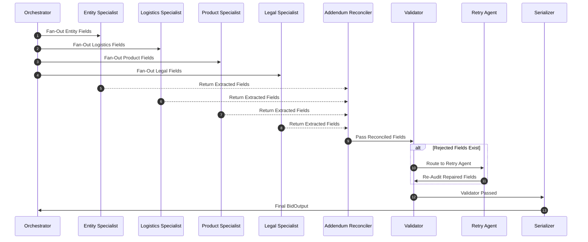

# Multi-Agent Execution Trace: `MultiAgent_RFP_Extraction_Bid1`
- **Run ID**: `run_4edf6119`
- **Timestamp**: `2026-10-04T08:02:02.185896+00:00`
- **Total Latency**: `35784.11 ms`
- **Total Spans**: `8`

## Execution Flow Hierarchy

## Span Details

| Step | Span Name | Status | Latency (ms) | Key Attributes |
|---|---|---|---|---|
| 1 | `Orchestrator_FanOut` | `success` | 0.01 | target_bid=Bid1 |
| 2 | `EntitySpecialistAgent` | `success` | 7714.25 | fields_extracted=['bid_number', 'title', 'company_name', 'bid_summary'], chunks_evaluated=4 |
| 3 | `LogisticsSpecialistAgent` | `success` | 13161.23 | fields_extracted=['due_date', 'bid_submission_type', 'term_of_bid', 'pre_bid_meeting', 'installation', 'delivery_date', 'payment_terms', 'contact_info'], chunks_evaluated=5 |
| 4 | `ProductSpecialistAgent` | `success` | 8130.58 | fields_extracted=['mfg_for_registration', 'model_no', 'part_no', 'product', 'product_specification'], chunks_evaluated=0 |
| 5 | `LegalSpecialistAgent` | `success` | 5323.92 | fields_extracted=['bid_bond_requirement', 'additional_documentation', 'contract_or_cooperative'], chunks_evaluated=1 |
| 6 | `AddendumReconciler` | `success` | 1432.08 | addendum_changes_count=0, modified_fields=[] |
| 7 | `ValidatorAgent` | `success` | 11.84 | is_valid=True, passed_fields_count=20, rejected_fields_count=0 |
| 8 | `SerializationNode` | `success` | 0.05 | total_fields_serialized=20, provenance_verified=True |
