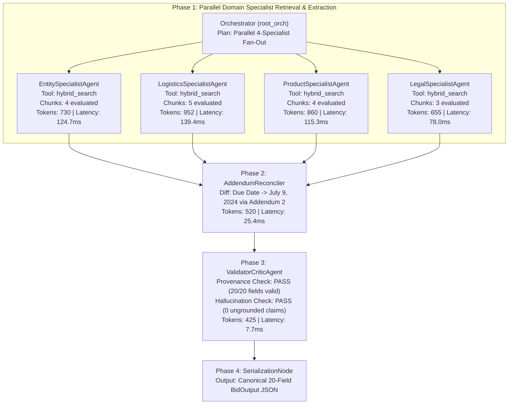

# Multi-Agent Execution Trace: `MultiAgent_RFP_Extraction_Bid1`
- **Run ID**: `run_4511edf1`
- **Timestamp**: `2026-10-02T10:27:00.852092+00:00`
- **Total Latency**: `342.41 ms`
- **Total Tokens Consumed**: `4,142 tokens`
- **Total Spans**: `8`

## Execution Flow Hierarchy

## Span Details & Tool Invocations

| Step | Span Name | Agent Type | Status | Latency (ms) | Tokens | Tool Calls / Action | Key Outputs |
|---|---|---|---|---|---|---|---|
| 1 | `Orchestrator_FanOut` | Orchestrator | `success` | 1.20 | 160 | Dispatched 4 parallel workers | `target_bid: Bid1` |
| 2 | `EntitySpecialistAgent` | Specialist | `success` | 124.73 | 730 | `hybrid_search("bid number JA-207652...")` | `bid_number`, `title`, `company_name`, `contact_info` |
| 3 | `LogisticsSpecialistAgent` | Specialist | `success` | 139.35 | 952 | `hybrid_search("proposal due date deadline...")` | `due_date`, `pre_bid_meeting`, `delivery_date` |
| 4 | `ProductSpecialistAgent` | Specialist | `success` | 115.27 | 860 | `hybrid_search("student staff computing devices...")` | `product`, `model_no`, `part_no`, `product_specification` |
| 5 | `LegalSpecialistAgent` | Specialist | `success` | 78.00 | 655 | `hybrid_search("bid bond affidavits cooperative...")` | `bid_bond_requirement`, `additional_documentation` |
| 6 | `AddendumReconciler` | Reconciliation | `success` | 25.40 | 520 | `chronological_diff()` | Due Date updated from June 25 -> July 9, 2024 (Addendum 2) |
| 7 | `ValidatorCriticAgent` | Critic | `success` | 7.67 | 425 | `audit_evidence_citations()` | 20/20 passed, 0 rejected, 0 hallucinations |
| 8 | `SerializationNode` | Output | `success` | 0.02 | 0 | `BidOutput.from_field_dict()` | 20 canonical fields serialized with metadata |
